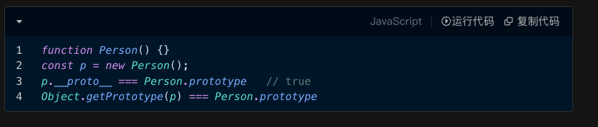

# 原型和原型链

js是一门基于原型的语言

## 1.原型对象

每个构造函数都有prototype属性，指向它的原型对象

每个对象都有__proto__属性（Object.getPrototypeof），指向它的构造函数的原型对象

即 Object.getPrototypeof(p1) === Person.prototype。

原型对象用来存储共享方法和共享属性

## 2.原型链

原型链决定了js中继承的实现方式。

对象访问属性时，若自身不存在，则通过__proto__属性逐级向上查找，直到Object.prototype这个对象的__proto__属性指向null。

## 3.特殊的原型链

1.函数本质上也是个对象，所以函数也有它的__proto__属性。

2.Function是最顶层的构造器，构造了系统所有的对象，包括用户定义的对象、系统内置对象、甚至包括它自己

`Person.__proto__ = Array.__proto__ = Object.__proto__ = Fcuntion.__proto__ = Function.prototype`

3.Object是最顶层的对象,所有的对象都继承自Object

`Person.prototype.__proto__ === Function.prototype.__proto__  === Object.prototype`

## 4.手写new

JS/手写/new.js

## 5.继承-todo

## 6.class

class是语法糖，底层还是原型链
